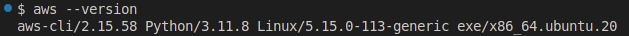
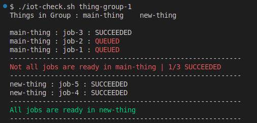

# AWS IOT Job Status Checker

Objective of this task was to create a script that would find the job execution status from AWS IOT using CLI. Script is provided a **thing-group** name, in the group it lists out all the **things**, and for each thing lists out all the **jobs** and check their status

## Prerequisites :
 - IOT device setup
 - AWS cli
 - linux
 
## Steps :

### 1. Setup AWS CLI
 - Setup AWS Account using command `aws configure`
 - Make sure AWS CLI is installed and configured
 
 

### 2. Run Script
 - To run the script use command `./iot-check.sh (thing-group-name)`

**Expected Output**

